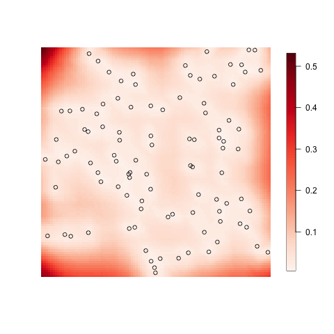
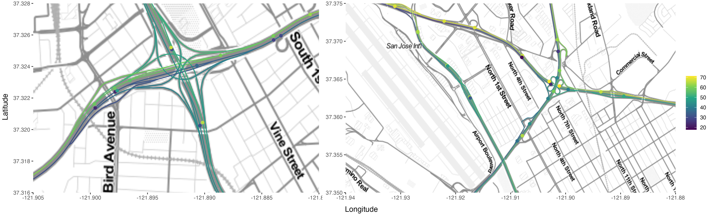

<figure style="text-align: center">

  <figcaption> The uncertainty of a latent Gaussian process, given observations (circles).</figcaption>
</figure>

## Ph.D. Position
We invite applications for a fully funded PhD position with a project on optimal design for Gaussian processes. The goal is to develop methods for the optimal placement of sample locations in space and time. An application will be to create a sampling scheme for acquiring knowledge about AMR and plastic distribution in the aquatic environment in the Philippines and Italy. The position is at Lund University, Sweden, and the coordinator is [Jonas Wallin](https://jonaswallin.github.io/). The project is in close collaboration with [Climate-Sensitive](https://csidlab.iwr.uni-heidelberg.de/index.html) Infectious Diseases lab](https://csidlab.iwr.uni-heidelberg.de/index.html) at the University of Heidelberg, Germany.

## Project Description
The design of any scientific investigation involves many considerations. When one is interested in experiments in nature, or any geographical data, it is often crucial at what location the measurements are conducted. Further the optimal locations are often different if one is interested in inference (understanding the relation between variables) or prediction. The statistical theory of where to optimally place locations falls under the subject of optimal design [3]. One of the most important processes to describe spatial data is Gaussian processes, which generate continuous random fields. Gaussian processes can defined both on regular Euclidean domain [3], river networks, or other complex topologies which were explored in the recent works [1,2] and implemented in package [4]. The Figure at the top shows the uncertainty in a Gaussian process after making observations, an optimal design question would be where to place the next observations to minimize the uncertainty.
In this project, we are both interested in exploring both theoretical and practical questions. The theoretical questions are for instance what characteristic of the random fields are most important for the adaptive design, and how to find algorithms that either place the location optimally or approximately with theoretical bounds on the errors. How does one build Gaussian models that are both on rivers and oceans situationally? Practial will be using the information in setting up an adaptive design, together with the Heidelberg group, that will be utilized to determine at what location should one measure AMR and plastic in the rivers and oceans. 

#### The candidate

We are looking for a student that fits the following criteria
  * MSc in mathematics, statistics, computer science, biostatistics, or physics 
  * Some experience programming skills (python, R, C++, etc. )
  * Some experience in spatial statistics, or numerical linear algebra is merting.  

## References
1. [D. Bolin, A. Simas, and J. Wallin. Gaussian Whittle-Matérn fields on metric graphs Bernoulli, in press, 2023](https://www.e-publications.org/ims/submission/BEJ/user/submissionFile/57882?confirm=4654b8a6)
2. [D. Bolin, A. Simas, J. Wallin.  Statistical inference for Gaussian Whittle-Matérn fields on metric graphs, arXiv](hhttps://arxiv.org/abs/2304.10372)
3. [P. Diggle, E. Giorgi. Model-based geostatistics for global public health](https://www.taylorfrancis.com/books/mono/10.1201/9781315188492/model-based-geostatistics-global-public-health-peter-diggle-emanuele-giorgi)
4. [Metric Graph packages](https://davidbolin.github.io/MetricGraph/)

