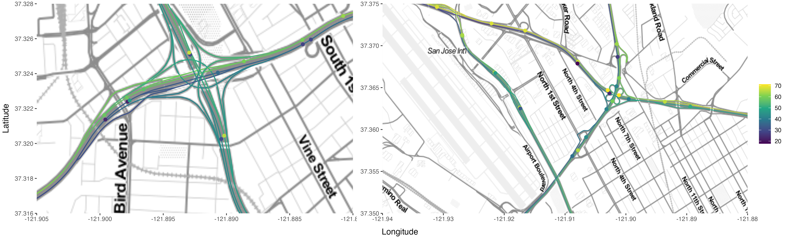

# PhD Position: Optimal Design for Gaussian Processes

We invite applications to a fully funded PhD position focusing on optimal design for Gaussian processes. The primary goal is to develop innovative methodologies for the optimal placement of sample locations in both space and time. The practical application of this research will involve creating a sampling scheme to enhance our understanding of antimicrobial resistance (AMR) and plastic distribution in aquatic environments in the Philippines and Italy. The position is based at Lund University in Sweden, under the guidance of [Jonas Wallin](https://jonaswallin.github.io/). Additionally, this position will involve close collaboration with the [Climate-Sensitive Infectious Diseases lab](https://csidlab.iwr.uni-heidelberg.de/index.html) at the University of Heidelberg in Germany.

## Project Description

Scientific investigations require careful consideration of various factors. When dealing with experiments in nature or geographical data, the strategic selection of measurement locations becomes crucial. The optimal locations differ based on whether the focus is on inference (understanding relationships between variables) or prediction. The statistical theory governing optimal location placement falls under the realm of optimal design [3].

Gaussian processes, a fundamental tool for describing spatial data, generate continuous random fields. These processes can be defined on regular Euclidean domains [3] or on complex topologies such as river networks [1-2], which is essential when dealing with processes on intricate spatial structures.

This project delves into both theoretical and practical aspects. Theoretical inquiries include identifying the most critical characteristics of random fields for adaptive design and devising algorithms that optimally place or approximate locations with theoretical bounds on errors. Another theoretical aspect involves constructing Gaussian models simultaneously on rivers and oceans. On the practical front, the information gathered will contribute to setting up an adaptive design, in collaboration with the Heidelberg group. This design will aid in determining optimal locations for measuring AMR and plastic in rivers and oceans.

### The Candidate

We seek a candidate who meets the following criteria:

- MSc in mathematics, statistics, or biostatistics
- Proficient programming skills (R and/or C++)
- Experience in spatial statistics or numerical linear algebra is advantageous.

## References
1. [D. Bolin, A. Simas, and J. Wallin. Gaussian Whittle-Matérn fields on metric graphs Bernoulli, in press, 2023](https://www.e-publications.org/ims/submission/BEJ/user/submissionFile/57882?confirm=4654b8a6)
2. [D. Bolin, A. Simas, J. Wallin.  Statistical inference for Gaussian Whittle-Matérn fields on metric graphs, arXiv](hhttps://arxiv.org/abs/2304.10372)
3. [P .Diggle, E. Giorgi. Model-based geostatistics for global public health](https://www.taylorfrancis.com/books/mono/10.1201/9781315188492/model-based-geostatistics-global-public-health-peter-diggle-emanuele-giorgi)

